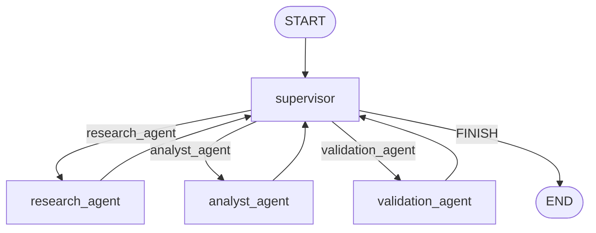

# Hierarchical Multi-Agent Orchestrator

Orquestador multiagente jerárquico con **LangGraph**: un **supervisor** enruta el trabajo entre un agente de **investigación** (Tavily), uno de **análisis** (sentimiento, puntos clave) y un nodo de **validación** con rúbrica antes de cerrar.

## Topología

Se eligió una topología **jerárquica con supervisor central** porque:

- Separa roles (buscar vs analizar vs validar) y reduce contaminación de contexto
- El supervisor decide dinámicamente el siguiente nodo o el cierre
- El nodo `validation_agent` aplica la rúbrica de suficiencia antes de `END`
- Un límite de pasos corta bucles infinitos

Flujo típico de demo: **research → analyst → validation → FINISH**.



También podés exportar el diagrama generado por LangGraph:

```bash
python main.py --mermaid
```

## Manejo de conflictos entre agentes

| Situación | Cómo se resuelve |
|-----------|------------------|
| Research y analyst aportan cosas distintas | Cada uno escribe en su campo (`research_findings` / `analysis_result`); no pisan el historial completo del otro |
| Output incompleto o flojo | `validation_agent` aplica la rúbrica; si falla, el supervisor reenvía con `validation_feedback` |
| Cierre prematuro | El supervisor no puede ir a `FINISH` si `validation_passed` es false |
| Loop infinito supervisor ↔ especialistas | `step_count` + `DEFAULT_MAX_STEPS` fuerzan `FINISH` |
| Contaminación de contexto | Los especialistas reciben solo consulta + hallazgos necesarios, no todo el chat |

## Estructura

```
├── state.py                 # OrchestratorState (MessagesState + campos de routing)
├── llm.py                   # Factory multi-LLM (openai | anthropic | gemini)
├── tools/
│   ├── research.py          # web_search (Tavily)
│   └── analysis.py          # sentimiento, puntos clave, validación JSON
├── agents/
│   ├── research_agent.py
│   ├── analyst_agent.py
│   ├── validation_agent.py
│   └── supervisor.py
├── graph.py                 # StateGraph compilado
├── main.py                  # CLI
├── demo.ipynb               # Demo del flujo de delegación
└── consignas.md
```

## Setup

```bash
python -m venv env
# Windows
.\env\Scripts\Activate.ps1
pip install -r requirements.txt
copy .env.example .env
```

Completá `.env`:

```env
LLM_PROVIDER=gemini   # openai | anthropic | gemini
GOOGLE_API_KEY=...
TAVILY_API_KEY=...
```

Modelos opcionales: `OPENAI_MODEL`, `ANTHROPIC_MODEL`, `GEMINI_MODEL`.

## Uso

```bash
python main.py "Que es LangGraph y que tan util es para multiagentes?"
python main.py --mermaid
```

## Demo

Abrí [`demo.ipynb`](demo.ipynb) y ejecutá las celdas. El notebook muestra:

1. El diagrama Mermaid del grafo
2. Un run con `stream` para ver la delegación nodo a nodo
3. La respuesta final y metadatos (`steps`, `validation_passed`, etc.)

Consulta sugerida (fuerza research → analyst → validation → cierre):

> ¿Qué es LangGraph y qué tan útil es para orquestar multiagentes? Respuesta breve.
